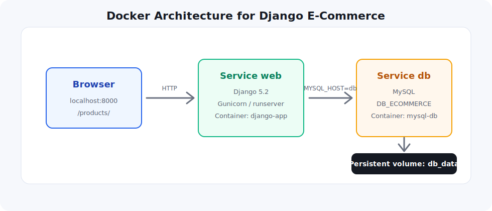

# Django E-Commerce with Docker and MySQL

Application e-commerce built with **Django**, deployed with **Docker**, and connected to a **MySQL** database.

It includes product management, user authentication, profile editing, product images, and a session-based cart.



## Visual Preview

| Product | Preview |
| --- | --- |
| PC HP |  |
| Samsung S24 |  |
| Mouse |  |
| Lenovo |  |

## Features

- User authentication: signup, login, logout.
- User profile: display and edit personal information.
- Products: list, details, image, price, stock, and category.
- Cart: add products, display quantities, line totals, and global total.
- Modern interface: Bootstrap 5 and custom CSS.
- Docker deployment: Django web service, MySQL service, `.env`, persistent volume.

## Technologies

| Tool | Purpose |
| --- | --- |
| Django | Web framework |
| MySQL | Database |
| Docker | Containerization |
| Docker Compose | Multi-container orchestration |
| WhiteNoise | Static files management |
| Gunicorn | WSGI server |
| Pillow | Product image support |

## Project Structure

```text
ecommerce/
|-- accounts/              # Authentication and user profiles
|-- ecommerce/             # Main Django configuration
|-- images/                # Uploaded product images / media files
|-- products/              # Products, categories, and cart
|-- static/                # CSS and static assets
|-- docs/                  # README visuals
|-- Dockerfile
|-- docker-compose.yaml
|-- entrypoint.sh
|-- requirements.txt
|-- .env
`-- README.md
```

## Docker Architecture

```text
Browser
  |
  | http://localhost:8000/products/
  v
Django container: web / django-app
  |
  | MYSQL_HOST=db
  v
MySQL container: db / mysql-db
  |
  v
Docker volume: db_data
```

## Run the Project

From the project root:

```bash
cd c:\Users\HP\Desktop\AT1\ecommerce
docker compose up -d --build
```

Check containers:

```bash
docker compose ps
```

Expected result:

```text
django-app   Up   0.0.0.0:8000->8000/tcp
mysql-db     Up   0.0.0.0:3306->3306/tcp
```

Open the app:

```text
http://localhost:8000/products/
```

If the old interface is still visible, refresh with:

```text
Ctrl + F5
```

## Django Admin

Create an admin user:

```bash
docker compose exec web python manage.py createsuperuser
```

Open the admin dashboard:

```text
http://localhost:8000/admin/
```

From the admin dashboard, you can add:

- categories;
- products;
- product images;
- prices;
- stock values.

## Environment Variables

The `.env` file stores the configuration used by Django and Docker Compose:

```env
DJANGO_SECRET_KEY=change-this-secret-key
DJANGO_DEBUG=1
DJANGO_ALLOWED_HOSTS=localhost,127.0.0.1

MYSQL_ROOT_PASSWORD=root
MYSQL_DATABASE=DB_ECOMMERCE
MYSQL_USER=django
MYSQL_PASSWORD=django
MYSQL_HOST=db
MYSQL_PORT=3306
```

Important:

```env
MYSQL_HOST=db
```

Inside Docker Compose, Django must connect to MySQL using the service name `db`, not `localhost`.

## Main URLs

| Page | URL |
| --- | --- |
| Products | `http://localhost:8000/products/` |
| Cart | `http://localhost:8000/products/cart/` |
| Login | `http://localhost:8000/accounts/login/` |
| Signup | `http://localhost:8000/accounts/signup/` |
| Profile | `http://localhost:8000/accounts/profile/` |
| Admin | `http://localhost:8000/admin/` |

## Useful Commands

```bash
# Build and start services
docker compose up -d --build

# Show running containers
docker compose ps

# Show Django logs
docker compose logs -f web

# Show MySQL logs
docker compose logs -f db

# Create migrations
docker compose exec web python manage.py makemigrations

# Apply migrations
docker compose exec web python manage.py migrate

# Create admin user
docker compose exec web python manage.py createsuperuser

# Enter MySQL
docker compose exec db mysql -u django -p DB_ECOMMERCE

# Stop containers
docker compose down
```

## Troubleshooting

### `localhost:8000` does not open

Check that the Django container is running:

```bash
docker compose ps
```

Then inspect the web logs:

```bash
docker compose logs web
```

### MySQL error: `Access denied for user 'django'`

Enter MySQL as root:

```bash
docker compose exec db mysql -u root -proot
```

Run:

```sql
CREATE USER IF NOT EXISTS 'django'@'%' IDENTIFIED BY 'django';
ALTER USER 'django'@'%' IDENTIFIED BY 'django';
GRANT ALL PRIVILEGES ON DB_ECOMMERCE.* TO 'django'@'%';
FLUSH PRIVILEGES;
```

Restart Django:

```bash
docker compose restart web
```

### Reset the database completely

Warning: this deletes the MySQL volume and all database data.

```bash
docker compose down -v
docker compose up -d --build
```

## Final Result

The final application should be available at:

```text
http://localhost:8000/products/
```

It should display products stored in MySQL with a modern visual interface.
